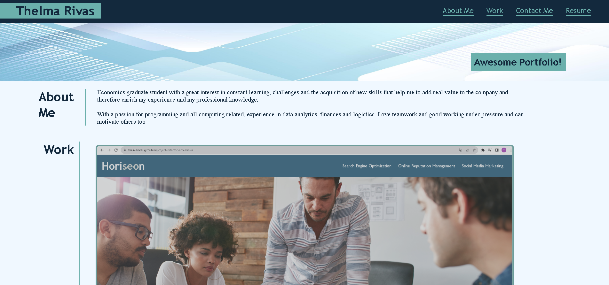

# awesome-portfolio

## Description

This project had the goal of creating a portfolio where I, as a bootcamp student, can put my finished projects so that people can see my work as a web developer and for myself to be accountable with I have accomplish. In this project I use basic HTML but with more advanced CSS properties such as media query, responsive design, flexbox layout, css selectors and variables and pseudo classes and elements. 

The challenge of this project was to build from zero the HTML structure and CSS styling, being, for me, the CSS styling the most difficult part. Since a lot of new and more advanced properties were implement, it was a bit confusing to add them in a correct and efficient way, but thanks to the new CSS properties I could create a more cool and interactive styling to the page, such as the hover property. 

## Installation

N/A

## Usage

The HTML can be found right away on the repository and the CSS file is located inside the assets folder, next to the images folder as well. If you check the HTML file, you can see semantic elements being used all over the html and classes that are link to the css stylesheet. On the css file you can see the new properties such as hover, flexbox, var, etc. In this case we didnt use the console, so for now nothing is found there. 

link to Github Pages --> https://thelmarivas.github.io/awesome-portfolio/

## Credits 

Use material and notes provided by Edx Bootcamp and MDN resources.

## License 

N/A